# Business-Driven AI and Data Science for the Large-Scale Chosun Ilbo Archive

> **As the first author**, I published this work in a data science journal indexed in **ESCI** and **Scopus**. Through an R&D industry-academia collaboration between KAIST and Chosun Ilbo Media Institute, I developed an AI data science foundation for automatically detecting and structuring four-panel cartoons hidden inside a large-scale newspaper archive, turning the results into searchable data assets, a reusable YOLOv5_FPC detector, Chosun Ilbo News Library public service value, book publication, and downstream IP business output. From problem definition to data collection, labeling, YOLOv5 fine-tuning, AI model evaluation, large-scale inference, database construction, and public-service implementation, I led and implemented the end-to-end AI workflow.

## 日本語概要

**第一著者として**、国際データサイエンス分野の英文学術誌（ESCI・Scopus収録）に論文が掲載され、大手メディア企業との産学連携プロジェクトを通じて、AIモデル開発、朝鮮日報ニュースライブラリにおける漫画公開サービスの構築、さらに書籍出版およびIPビジネスへと展開した、実ビジネス直結型のAIデータサイエンスプロジェクトです。  
KAISTとChosun Ilbo Media InstituteによるR&D産学連携プロジェクトとして、大規模な新聞アーカイブに埋もれた四コマ漫画を自動検出・構造化し、検索可能なデータ資産として活用できるAIデータサイエンス基盤を構築しました。  
本プロジェクトでは、課題定義からデータ収集、ラベリング、AIモデル学習、既存のYOLOv5をファインチューニングした四コマ漫画検出特化型YOLOv5_FPCモデルの開発、AIモデル評価、大規模推論、データベース構築、公開サービス実装まで、End-to-EndのAIワークフロー全体を主導して設計・実装しました。

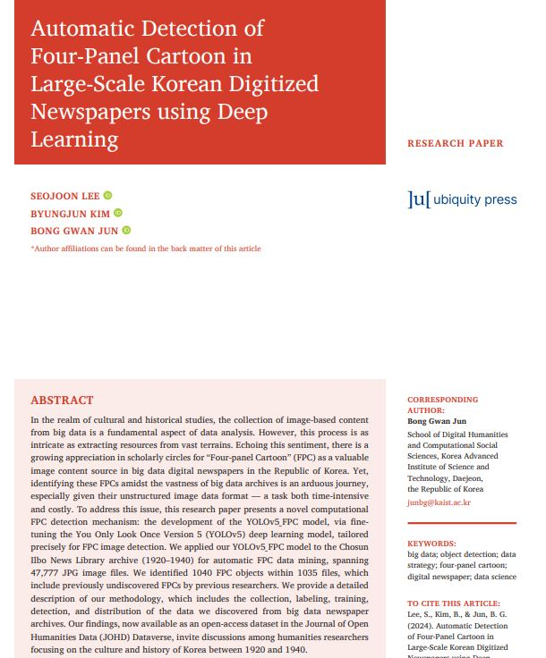

**Paper Link:** [Journal of Open Humanities Data - Automatic Detection of Four-Panel Cartoon in Large-Scale Korean Digitized Newspapers using Deep Learning](https://openhumanitiesdata.metajnl.com/articles/10.5334/johd.205)

## Project at a Glance

This repository presents a professional case study of my first-author English journal publication and the underlying R&D industry AI project conducted with Chosun Ilbo Media Institute during my master's program at KAIST.

**Lee, S., Kim, B., & Jun, B. G. (2024). Automatic Detection of Four-Panel Cartoon in Large-Scale Korean Digitized Newspapers using Deep Learning. Journal of Open Humanities Data, 10:36. DOI: [10.5334/johd.205](https://doi.org/10.5334/johd.205).**

The project was conducted as an **R&D industry collaboration with Chosun Ilbo Media Institute during my master's program at KAIST**. The business challenge was driven by rising demand for cartoon content in East Asia: Chosun Ilbo wanted to explore new archive-based business and service opportunities by finding four-panel cartoons hidden inside its massive historical newspaper database, but the starting point was unclear because the target content was embedded in unstructured scanned pages and difficult to detect manually or programmatically. I owned the work end-to-end: clarifying the ambiguous business/research problem, converting it into a business, data science, and AI workflow, collecting and labeling FPC training data, developing the YOLOv5_FPC model through YOLOv5 fine-tuning, evaluating the AI model, running large-scale detection, curating the metadata/database, building a reusable detector script, and communicating the result through a first-author publication.

| Area | Result |
| --- | --- |
| Publication | First-author English journal paper in Journal of Open Humanities Data |
| Indexing | JOHD is indexed in Web of Science Emerging Sources Citation Index (ESCI) and Scopus |
| Academic / R&D context | KAIST master's program R&D industry project |
| Industry partner | Chosun Ilbo Media Institute |
| Archive scope | 47,777 digitized Chosun Ilbo newspaper JPG images from 1920-1940 |
| Detection output | 1,040 four-panel cartoon objects in 1,035 image files |
| Model result | F1-confidence score of 0.97 at confidence threshold 0.708 |
| Business impact | Searchable archive content asset, reusable research dataset, Chosun Ilbo public archive service value, and book/IP business output |

## Business-First Positioning

This project is best understood as an **ambiguous-business-problem-to-deliverable AI case study**. The starting point was not a clean benchmark dataset or a predefined Kaggle-style task. It was a broad industry problem: growing demand for cartoon content created a new business opportunity, but the valuable content was buried inside a large legacy media archive. The challenge was how to extract hidden value from that archive, reduce manual discovery cost, convert unstructured newspaper images into a searchable data asset, and create new public archive service value.

I structured the business problem into sequential delivery workstreams: business problem framing, archive source-data extraction, labeled dataset construction, object detection model adaptation, AI model evaluation, large-scale inference, detected-result curation, reusable detector development, and publication/service handoff.

| Business Need | Delivered Outcome |
| --- | --- |
| Find four-panel cartoons for new archive-based business value | YOLOv5_FPC detector applied to 47,777 newspaper images |
| Reduce manual search and curation effort | Automated detection plus URL-based result files |
| Turn unstructured images into reusable data | Curated metadata/database and public datasets |
| Create public-facing archive service and IP business value | Results connected to Chosun Ilbo News Library service and downstream book publication |

## Why This Project Matters

Historical newspaper archives contain valuable visual materials, but they are difficult to search, reuse, or monetize as content assets when the content is locked inside scanned image pages. In this project, the target object was the Korean four-panel cartoon (FPC), especially the "Meongteongguri" series in Chosun Ilbo's digitized archive.

The practical challenge was not just training a model. The real problem was building a pipeline that could transform unstructured archive images into structured, searchable cultural data.

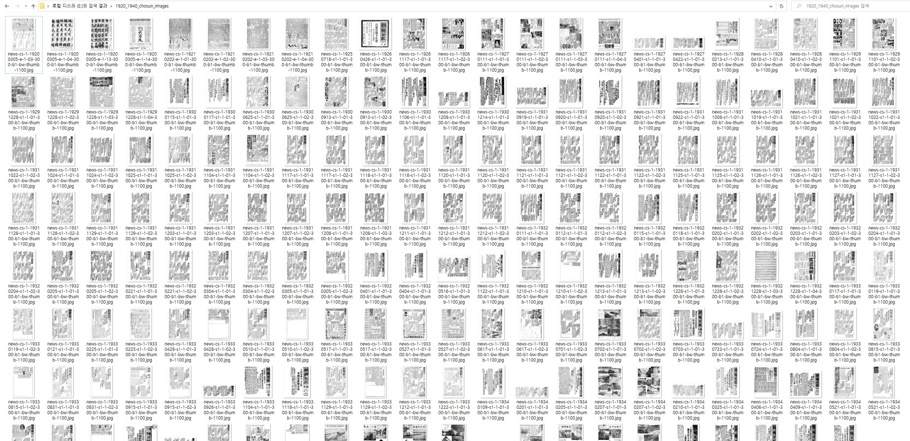

## My End-to-End Ownership

I led the technical and analytical work across the full lifecycle:

- Defined the detection problem with the research and industry context.
- Collected and reviewed training data for four-panel cartoon detection.
- Built bounding-box labels and prepared YOLO-format datasets.
- Collected and analyzed large-scale Chosun Ilbo archive image metadata.
- Fine-tuned YOLOv5 for FPC-specific object detection.
- Evaluated model behavior using precision, recall, mAP, loss curves, and F1-confidence.
- Ran batch detection over 47,777 historical newspaper images.
- Curated detected results into a metadata/database format.
- Contributed writing, methodology, software, formal analysis, visualization, and review/editing as first author.
- Helped turn research output into reusable public data and visible archive-service impact.

> **担当範囲:** 曖昧なビジネス課題の具体化、学習データ作成、ラベリング、YOLOv5 fine-tuning、AIモデル評価、大規模検出、メタデータ/DB構築、検出スクリプト開発、論文執筆・可視化までを一貫して担当しました。

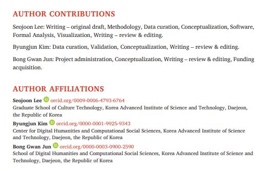

## End-to-End Delivery Flow

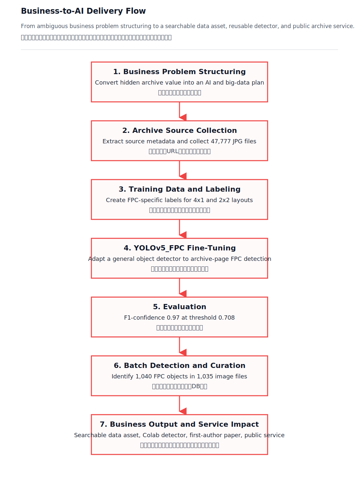

## Technical Challenge

The initial YOLOv5 model was trained on general-purpose COCO categories. It did not understand the target object and produced irrelevant detections on historical newspaper pages.

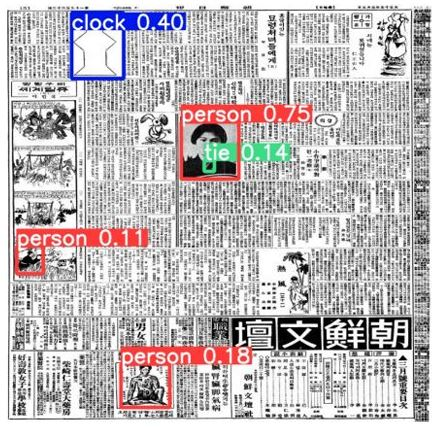

To solve this, I fine-tuned the YOLOv5 model on the FPC training dataset I collected, developing the **YOLOv5_FPC model** for four-panel cartoon detection. The model needed to handle:

- Degraded historical scans.
- Dense Korean/Japanese text layouts.
- Small cartoon objects embedded inside full newspaper pages.
- Different FPC layouts such as 4x1 and 2x2.
- Large-scale detection where manual review alone would be costly.

> **技術課題:** 一般的なCOCO事前学習モデルでは検出できない対象に対して、自ら収集したFPC学習データを用いてYOLOv5をfine-tuningし、YOLOv5_FPCモデルを開発しました。

## Model Development and Evaluation

The YOLOv5_FPC model was developed by fine-tuning YOLOv5 with a self-collected FPC training dataset split into training, validation, and testing sets. The paper reports a split of **113 training images**, **24 validation images**, and **24 testing images**.

The training curves showed improved localization, objectness, and classification behavior over 200 epochs.

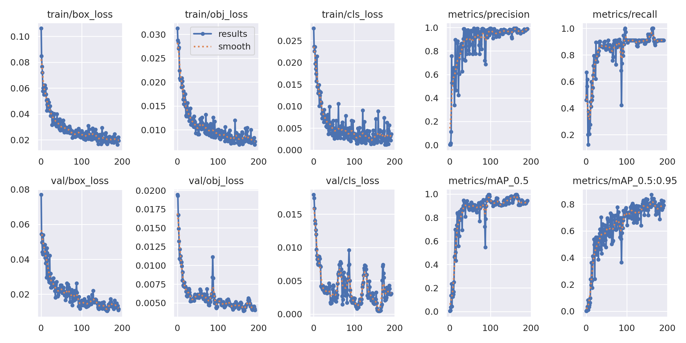

The fine-tuned AI model achieved a strong F1-confidence result:

- **F1-score:** 0.97
- **Confidence threshold:** 0.708
- **Classes:** 4x1 and 2x2 four-panel cartoon categories

The mathematical foundation of the model evaluation, including the YOLO-family loss objective, notation, precision, recall, and F1-score formulas, is documented in [AI Model Evaluation](docs/model-evaluation.md#mathematical-foundation).

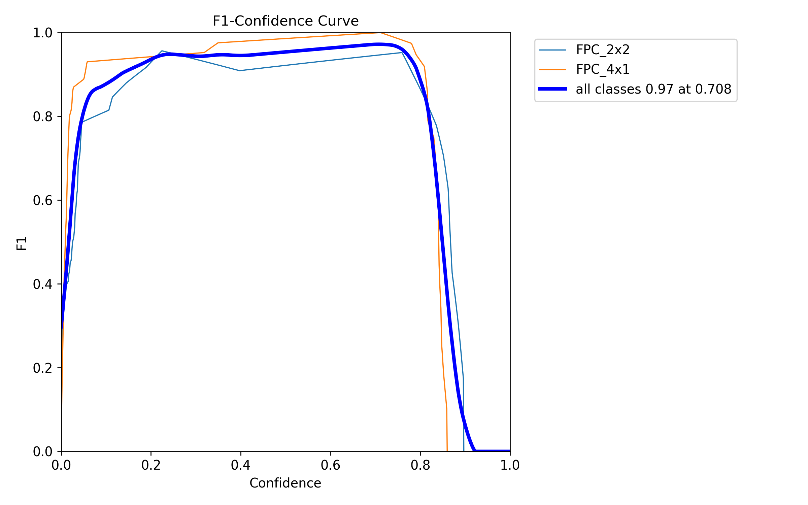

The following representative detection result shows the fine-tuned YOLOv5_FPC model detecting both 4x1 and 2x2 FPC layouts on a full historical newspaper page.

> **評価観点:** 数値指標だけでなく、実際の新聞紙面上で対象物を正しく局所化できるかを確認しました。

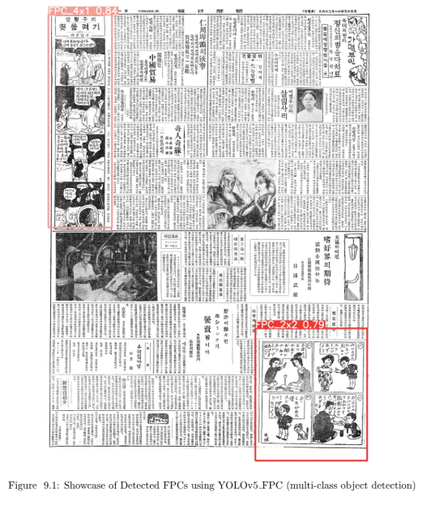

The detector also handled damaged or partially missing historical newspaper pages, which was important for real archive data rather than clean benchmark images.

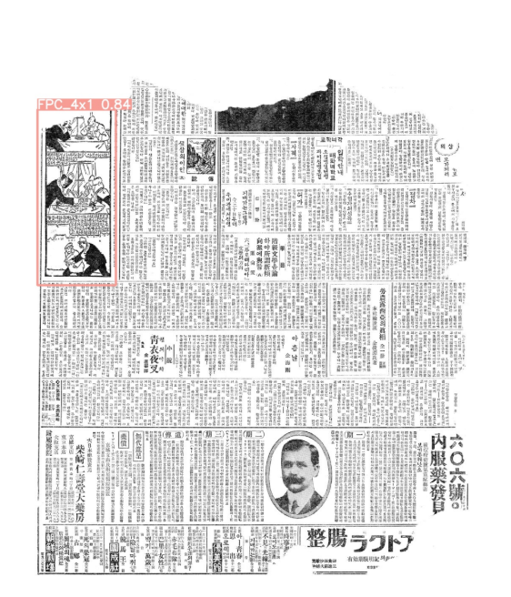

## Data and Database Curation

The data work had two separate stages: first, building the source archive image collection; second, curating the model-detected FPC results.

At the beginning of the project, I extracted and organized the source metadata and image URLs used to collect the **47,777 JPG files** from the Chosun Ilbo News Library. This spreadsheet represents the input archive collection stage, not the final detection result.

> **データ基盤:** 47,777件の画像URLとメタデータを整理し、大規模推論に利用できる入力データ基盤を構築しました。

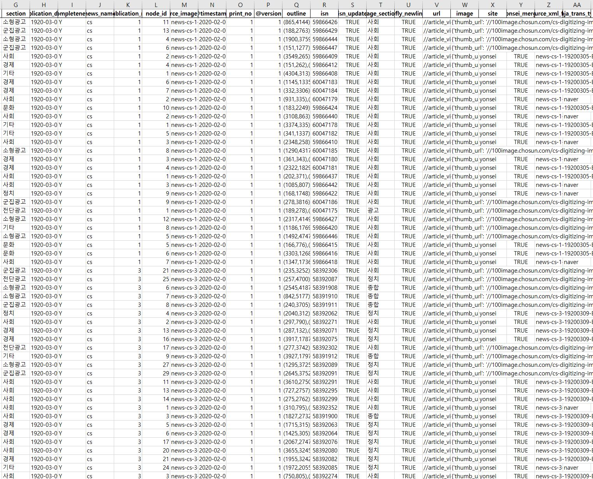

After model evaluation, I applied the detector to the archive at scale. The pipeline identified **1,040 FPC objects** in **1,035 files**, and the detected outputs were curated into result files with direct URLs to the discovered FPC-containing newspaper images.

> **成果データ:** 検出結果はURL付きの結果ファイルとして整理し、研究者やサービス側が再利用できる形にしました。

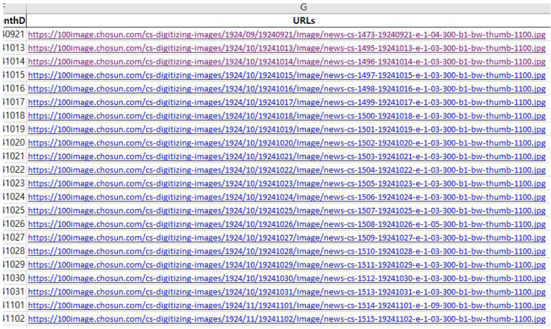

## Public YOLOv5_FPC Detector Script

As part of the paper, I also developed a **YOLOv5_FPC Detector script on Google Colab** so that other users could upload local image ZIP files and detect four-panel cartoons without setting up a local GPU environment.

The script installs YOLOv5 dependencies, downloads the trained YOLOv5_FPC weights, accepts a ZIP file upload, runs detection, saves label outputs, packages the detected images, and returns a downloadable ZIP file.

> **再利用性:** Google Colab上で動作する検出スクリプトを用意し、ローカルGPU環境がないユーザーでもFPC検出を試せるようにしました。

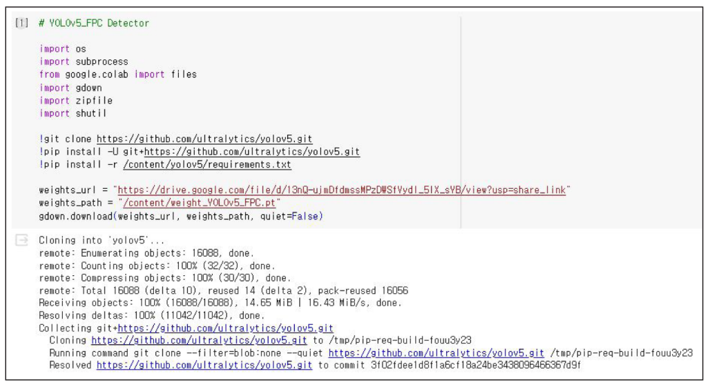

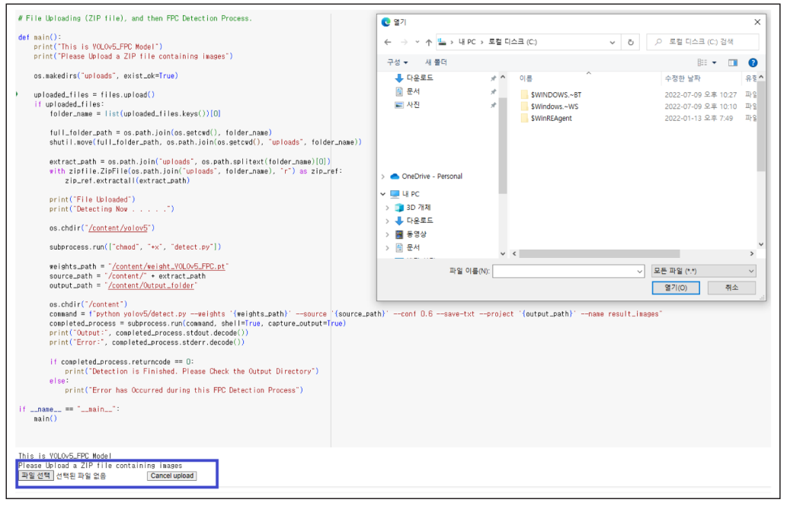

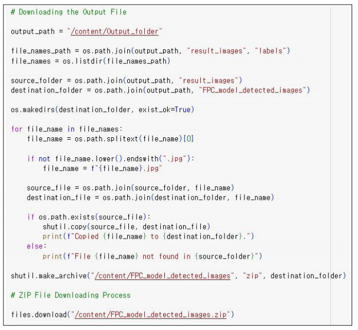

## Publication and Business Impact

This project was published as a first-author paper in the **Journal of Open Humanities Data**, an English journal indexed in **ESCI** and **Scopus**. The paper and datasets make the methodology and discovered data reusable for archive data infrastructure, content/IP discovery, and large-scale document AI.

The work also contributed to the public-facing Chosun Ilbo News Library experience for "Meongteongguri" four-panel cartoons. The broader restoration and service launch was covered by the Journalists Association of Korea, which reported that the project began as a Chosun Ilbo Media Institute research task, used deep-learning detection technology, and led to a public release of the restored series.

The project also connected to book/IP business output through the publication of *Meongteongguri*, where I participated as a co-author. For public documentation safety, this repository uses a single cover/reference image and does not redistribute interior pages or book contents.

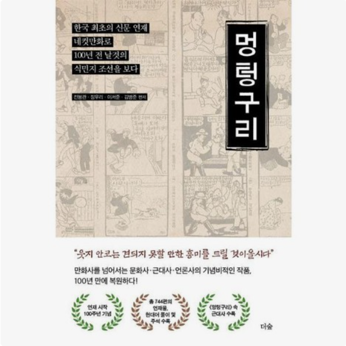

*Book/IP business output connected to archive restoration, four-panel cartoon discovery, and public service value.*

> **ビジネスインパクト:** 研究成果は公開データセット、論文、再利用可能なAI検出ツール、朝鮮日報ニュースライブラリの公開サービス、さらに書籍/IPビジネス成果へと接続されました。

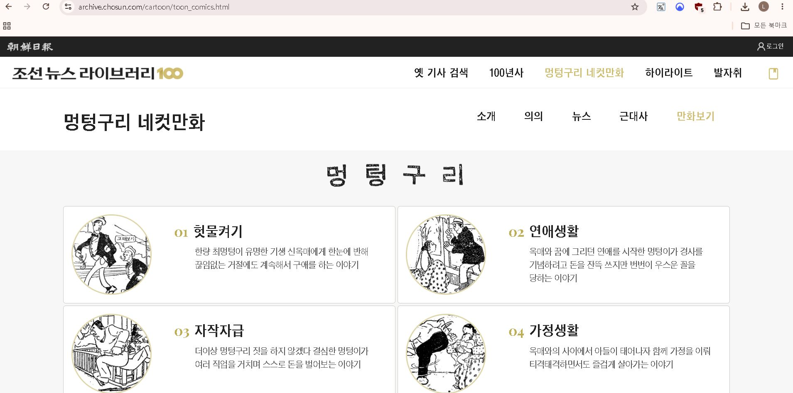

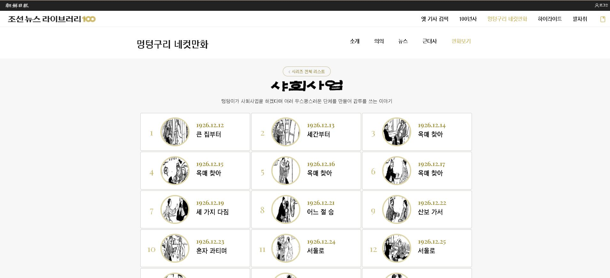

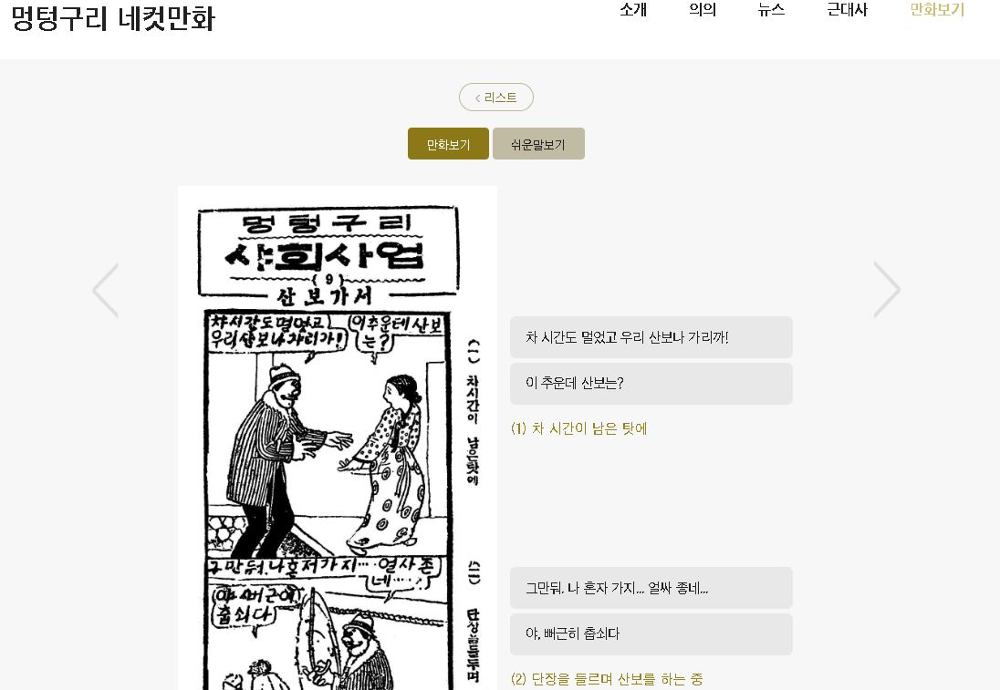

*Website Link: [Chosun Ilbo News Library - Meongteongguri four-panel cartoons](https://archive.chosun.com/cartoon/toon_comics.html).*

## Public Data and Copyright Note

This repository is a public technical case study built from already published research outputs, public service screenshots, and publicly accessible references. It does **not** redistribute a private source archive dump, proprietary internal materials, or unpublished collaboration files.

The research was conducted as a KAIST master's R&D industry project with Chosun Ilbo Media Institute, and the relevant publication, dataset references, and public archive service are already available online. The repository focuses on explaining my role, methodology, evaluation, and impact for public technical documentation.

> **日本語要約:** 本リポジトリは、公開済みの論文、公開データセット参照、公開サービス画面に基づく技術ケーススタディです。非公開の原本アーカイブ、内部資料、未公開の協業ファイルは再配布していません。

## Links

- Paper: [Journal of Open Humanities Data article](https://openhumanitiesdata.metajnl.com/articles/10.5334/johd.205)
- Journal indexing: [JOHD About page](https://openhumanitiesdata.metajnl.com/about)
- Public service: [Chosun Ilbo News Library - Meongteongguri four-panel cartoons](https://archive.chosun.com/cartoon/toon_comics.html)
- Media coverage: [Journalists Association of Korea article](https://www.journalist.or.kr/news/article.html?no=56909)
- Metadata dataset DOI: [10.7910/DVN/DFVZWE](https://doi.org/10.7910/DVN/DFVZWE)
- Extracted FPC dataset DOI: [10.7910/DVN/KTF1HP](https://doi.org/10.7910/DVN/KTF1HP)
- YOLOv5_FPC Detector Colab script: [Google Colab](https://colab.research.google.com/drive/1qnCKaUGUTF5vSRdPc7DI6y7b05P8yuQ?usp=sharing)

## Detailed Documentation

- [Case study](docs/case-study.md)
- [Methodology](docs/methodology.md)
- [Model evaluation](docs/model-evaluation.md)
- [Publication and business impact](docs/publication-and-impact.md)

## Japanese Summary

Japanese version: [README.ja.md](README.ja.md).
