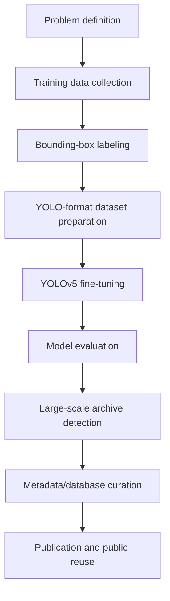

# Methodology

## Overview

The methodology followed a practical computer vision pipeline for historical document analysis:

## Problem Definition

The target object was the four-panel cartoon (FPC) embedded inside historical newspaper page images. The task was formulated as object detection because the output needed both classification and localization.

The central question was:

> Can a fine-tuned detector discover four-panel cartoon regions from large-scale historical newspaper scans accurately enough to support research data curation and public archive use?

## Data Collection and Labeling

The training dataset was created from FPC image examples. Bounding boxes were manually prepared around target cartoon regions and converted into YOLOv5-compatible labels.

The dataset contained two layout-oriented FPC categories:

- `FPC_4x1`
- `FPC_2x2`

The paper reports a split of:

| Split | Images |
| --- | ---: |
| Training | 113 |
| Validation | 24 |
| Testing | 24 |

## Model Fine-Tuning

The base YOLOv5 model was not sufficient for the target domain because it was trained on general-purpose COCO objects. On historical newspaper pages, the baseline model produced irrelevant detections such as generic object categories.

Fine-tuning adapted the model to the visual structure of FPCs:

- Historical scan quality.
- Small object regions.
- Dense newspaper layouts.
- Mixed Korean and Japanese text.
- FPC-specific shapes and layout patterns.

## Large-Scale Detection

After evaluation, the fine-tuned model was applied to the Chosun Ilbo News Library archive:

- Time range: 1920-1940
- Input scale: 47,777 JPG newspaper images
- Output: 1,040 FPC objects in 1,035 files

## Metadata and Database Curation

The detection output was curated into structured records with archive metadata, URLs, image identifiers, and publication information. This transformed model output into a reusable data asset for researchers and service users.

## Public Reuse

The methodology and results were published through:

- First-author JOHD paper.
- Harvard Dataverse dataset references.
- Public Chosun Ilbo archive service materials.

This makes the project useful beyond a single model experiment: it provides a repeatable approach for discovering visual cultural heritage objects in large-scale digitized archives.
