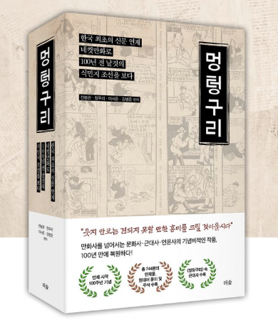

# Publication and Business Impact

## Publication

This work originated from an R&D industry project conducted with Chosun Ilbo Media Institute during my master's program at KAIST.

This project was published as a first-author English journal paper:

> Lee, S., Kim, B., & Jun, B. G. (2024). Automatic Detection of Four-Panel Cartoon in Large-Scale Korean Digitized Newspapers using Deep Learning. Journal of Open Humanities Data, 10:36, pp. 1-15. DOI: https://doi.org/10.5334/johd.205

The Journal of Open Humanities Data states that it is indexed in:

- Web of Science, Emerging Sources Citation Index (ESCI)
- Scopus
- Directory of Open Access Journals (DOAJ)

## First-Author Contribution

The paper's author contribution statement lists my contribution areas as:

- Writing - original draft
- Methodology
- Data curation
- Conceptualization
- Software
- Formal analysis
- Visualization
- Writing - review and editing

## Public Dataset and Reuse

The research output includes publicly referenced dataset materials:

- Metadata dataset DOI: https://doi.org/10.7910/DVN/DFVZWE
- Extracted FPC dataset DOI: https://doi.org/10.7910/DVN/KTF1HP
- YOLOv5_FPC Detector Colab script: https://colab.research.google.com/drive/1qnCKaUGUTF5vSRdPc7DI6y7b05P8yuQ?usp=sharing

The portfolio repository does not redistribute private source archives or internal collaboration files. It links to public research outputs and explains the methodology, ownership, and impact.

## Chosun Ilbo Public Archive Service

The detected and curated results are connected to Chosun Ilbo's public archive experience for "Meongteongguri" four-panel cartoons:

- Public service: https://archive.chosun.com/cartoon/toon_comics.html

## Media Coverage and External Validation

The broader restoration and public release was covered by the Journalists Association of Korea:

- Media article: https://www.journalist.or.kr/news/article.html?no=56909

The article reports that the restoration began as a Chosun Ilbo Media Institute research project, that KAIST Prof. Bong Gwan Jun's team performed the task, that deep-learning detection technology was used, and that the extracted cartoons were connected to service work by Chosun Ilbo digital teams.

> **日本語要約:** 外部メディア報道により、研究課題、深層学習による検出、デジタル復元、公開サービス化までの流れが確認できるため、単なる研究ではなく実ビジネス成果につながったプロジェクトとして説明できます。

## Book and IP Business Output

The project also connected to book/IP business output through the publication of *Meongteongguri*, where I participated as a co-author. This is useful portfolio evidence because it shows that the data science and AI pipeline did not stop at model development; it supported content discovery, archive restoration, service value, and downstream IP/business use.

For public-portfolio safety, this repository includes only the book cover as evidence and does not redistribute interior pages.

## Professional Impact

For Data Scientist and AI Developer hiring review, this project shows:

- Peer-reviewed research communication.
- KAIST master's R&D industry collaboration with Chosun Ilbo Media Institute.
- Real-world data processing at archive scale.
- Computer vision model adaptation to a difficult domain.
- Dataset and metadata design.
- Public-facing impact beyond a notebook experiment.
- Business impact connected to public service, media validation, and book/IP output.

## Interview Talking Points

Good interview questions this project can support:

- How did you define the detection task from the original archive problem?
- Why was baseline YOLOv5 insufficient?
- How did you build and validate the labeled dataset?
- What tradeoffs did you consider for confidence threshold selection?
- How did you convert detections into database-ready metadata?
- What parts of the project required stakeholder collaboration?
- What would you modernize if rebuilding the pipeline today?
